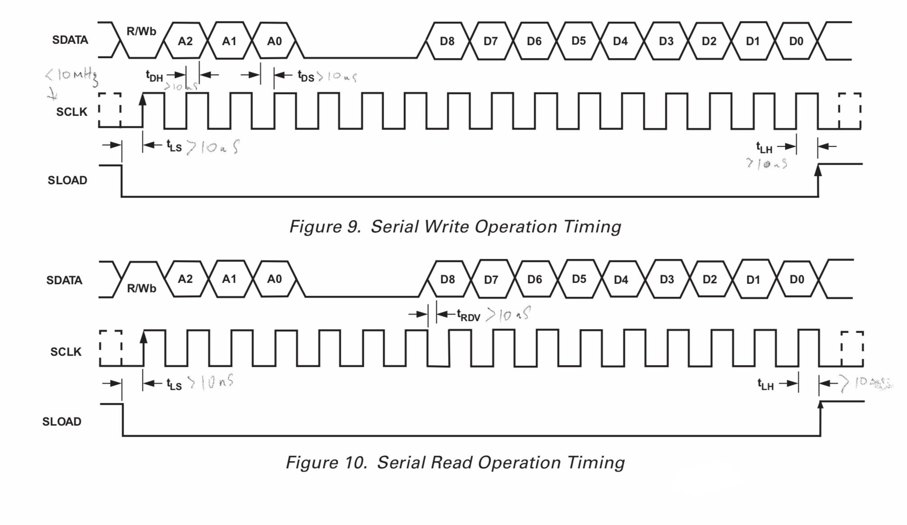

# Analogue to digital converter

The Analogue to digital converter (ADC) component is responsible for converting the signal output by the CCD into a digital format
suitable for storage a processing on a computer. 

Our camera is based on the [AD9826](https://www.analog.com/media/en/technical-documentation/data-sheets/AD9826.pdf) chip.
A video signal processor developed by Sony. This ADC can operate at a rate of 15MSPS with a resolution of 16 bits. 
With this chip we sould be able to achieve a readout time of less than 10 seconds for even the lagest of sensors that 
we might employ in this project.

The chip is capable of 3 channel operation at speeds of up to 30 MSPS. However we will use only a single channel to process
all pixels on the CCD.

## AD9826 Serial interface

### 3 wire interface
* SData - bidirectional
* SClk - driven by master
* SLoad - driven by master

### Timing

### Quiet state
1. SLoad held HIGH by master
1. SClk and SData, don't care

### Control registers
* control the operation of the ADC
* 8 registers in total
* Each register is 9 bits wide

### Read from ADC control register
Control register address is (A2, A1, A0)

1. Set SData pin for OUTPUT
1. Set SData HIGH, SClk LOW and SLoad LOW
1. Hold for > 10nS
1. Transition SClk HIGH and hold for > 10nS
1. Transition SClk LOW and hold for > 10nS
1. Set SData to A2 and hold for > 10nS
1. Transition SClk HIGH and hold for >10nS
1. Transition SClk LOW and hold for > 10nS
1. Repeat steps 5 through 7 to output A1 and A0
1. Set SData pin for INPUT
1. Repeat 3 times: SClk HIGH, wait > 10nS, SClk LOW, wait 10nS
1. For n=8 to 0: 
1. - SClk HIGH, Wait > 10nS
1. - Read value from bit n of control register from SData
1. - SClk LOW, Wait > 10nS 
1. Set SData pin for OUTPUT
1. Transition SLoad to HIGH
1. Wait > 10nS
	

